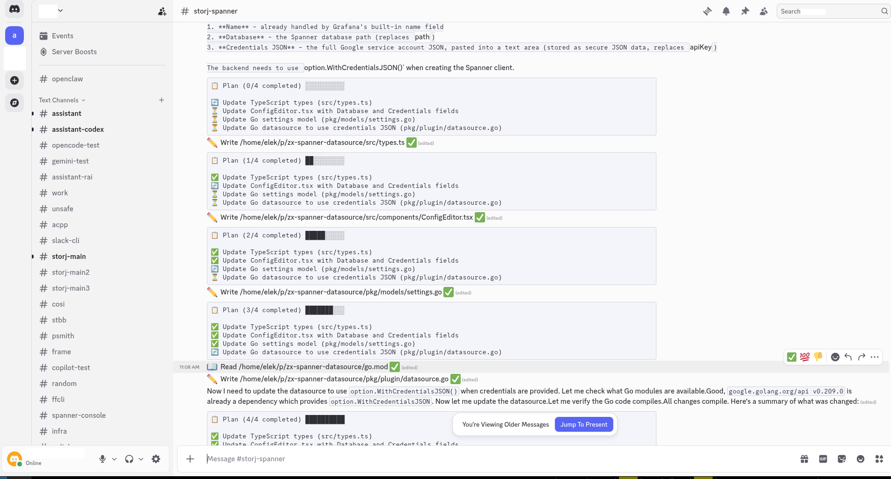

# ACPP — Agent Client Protocol Proxy

ACPP is a multi-channel proxy for AI coding agents. It bridges agent protocols (ACP subprocess, OpenCode HTTP) to communication channels (Discord, Console, Web UI), providing session management, usage tracking, and persistent logging.



## Status


 * The discord server is used as a daily driver 
 * Web is used for checking stats, but the session management part is WIP
 * Android app is highly experimental and WIP
 * Desktop app is highly experimental and WIP

## Installation

```bash
go install github.com/elek/acpp@latest
```

Or build from source:

```bash
go build -o acpp .
```

## Quick Start

### Web server (and optional Discord bot)

Start the web UI, scheduler, and — when a Discord token is configured — the
Discord bot, all on a shared router:

```bash
acpp serve
```

Discord is enabled automatically when a token is available (`--token` flag or
`discord_token` in config); without one, `serve` runs the web UI alone.
## Session Commands

These commands work across all channels (Discord, Console, Web):

| Command | Description |
|---------|-------------|
| `/start` | Create a new session |
| `/stop` | Stop the active session |
| `/status` | Show session info and usage |
| `/cancel` | Cancel the current operation |
| `/clear` | Restart session with same config |
| `/exit` | Shutdown the application |
| `/modes` | List available agent modes |
| `/mode <id>` | Switch agent mode |
| `/pwd` | Show working directory |
| `/cd <dir>` | Change directory (restarts session) |
| `/ls [dir]` | List directory contents |
| `!<cmd>` | Execute a shell command |

## Internal model

 * Session: one client may use more sessions.
 * Client an ACP client connection. Tight to an ACP session. 
 * Conversation: a conversation from an agentic loop (ACPSession + usage metadata)
 * Project: collection of one or more sessions (usually tight to a single GitHub repo)
 * Process: a running ACP agent instance (stdin, stdout)


## Configuration

Config file: `~/.config/acpp/config.yaml` (or `$XDG_CONFIG_HOME/acpp/config.yaml`)

```yaml
# PostgreSQL connection for session persistence
database:
  dsn: "postgres://localhost/acpp?sslmode=disable"

# Discord bot token (alternative to DISCORD_TOKEN env var)
discord_token: "..."

# Web UI listen address
web_addr: ":8080"

# Default session parameters
defaults:
  agent: "claude-code-acp"
  sandbox: "bwrap.sh"
  env_whitelist:
    - PATH
    - HOME
    - ANTHROPIC_API_KEY

# Resolve project directories from channel name
search_path:
  - /home/user/projects

# Directory containing sandbox scripts
sandbox_dir: /opt/sandboxes

# Tool permission rules
tool_permissions:
  - kind: "execute"
    action: "ask"          # "ask" or "deny"
    contains: ["rm", "sudo"]

# OpenTelemetry OTLP exporter
otlp:
  endpoint: "localhost:4317"
  tls:
    insecure: true
```

### Directory Auto-Detection

When `search_path` is configured, ACPP maps Discord channel names to project directories automatically. A channel named `myproject` will use `/home/user/projects/myproject` if it exists.

## Database

ACPP uses PostgreSQL for session persistence and event logging. Migrations run automatically on startup via [goose](https://github.com/pressly/goose).

The database is optional — without it, sessions are ephemeral.

### Schema

- **session** — tracks agent, directory, status, token usage, cost, and timing
- **log** — stores all session events (prompts, responses, tool calls) as JSONB

## Monitoring

- **Prometheus metrics** exposed on `:9090` by default
- **OpenTelemetry OTLP** export via the `otlp` config section
- **Web UI** with live WebSocket streaming of session events

## License

See [LICENSE](LICENSE) for details.
